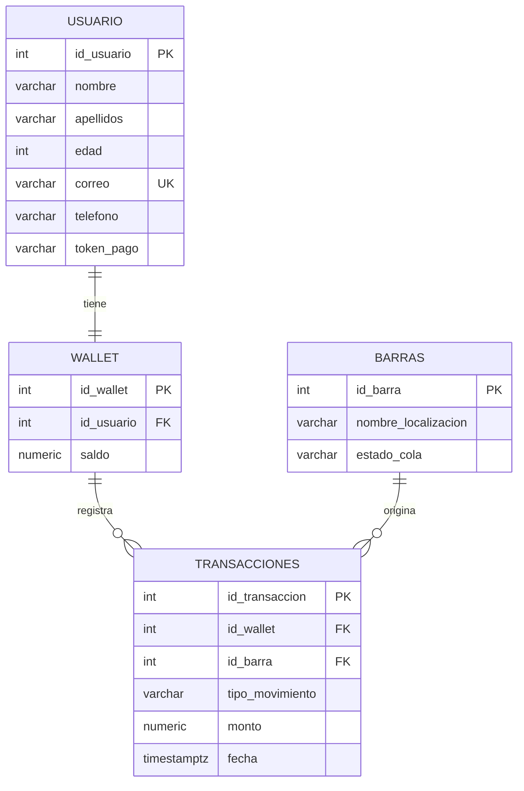
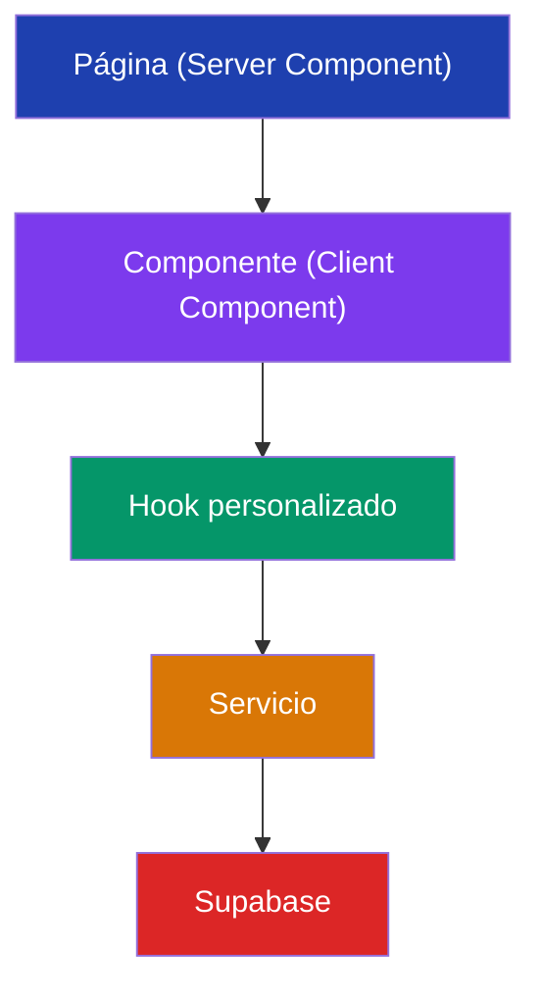

# 🎶 FestiApp — Plataforma de Experiencia en Festivales

## Índice

1. [Visión del Proyecto](#visión-del-proyecto)
2. [Tech Stack](#tech-stack)
3. [Estructura del Proyecto](#estructura-del-proyecto)
4. [Convenciones de Código](#convenciones-de-código)
5. [Esquema de Base de Datos](#esquema-de-base-de-datos)
6. [Arquitectura y Patrones](#arquitectura-y-patrones)
7. [Funcionalidades del MVP](#funcionalidades-del-mvp)
8. [Guía de Contribución y Git Workflow](#guía-de-contribución-y-git-workflow)
9. [Variables de Entorno](#variables-de-entorno)
10. [Configuración Local](#configuración-local)
11. [Futuras Integraciones](#futuras-integraciones)

---

## Visión del Proyecto

FestiApp es un **MVP web** diseñado para mejorar la experiencia de los asistentes a festivales y ayudar a la organización a gestionar mejor sus recursos.

**Problema**: Los datos que recopila la organización no se aprovechan para mejorar la experiencia del usuario en tiempo real.

**Solución**: Una web app que permite a los asistentes:

- Ver el **estado de las colas** en las barras del recinto.
- Recibir **notificaciones** cuando una barra tiene poca cola.
- Gestionar una **billetera digital** para consultar saldo y recargar.

Y permite al **staff/administrador**:

- Actualizar manualmente el estado de las colas de cada barra.
- Visualizar datos de consumo y transacciones.

---

## Tech Stack

| Tecnología | Uso | Versión |
|---|---|---|
| **Next.js** | Framework principal (App Router) | 14.x |
| **React** | Librería de UI | 18.x |
| **TypeScript** | Tipado estático | 5.x |
| **Tailwind CSS** | Estilos utilitarios | 3.x |
| **shadcn/ui** | Componentes de UI accesibles | latest |
| **Supabase** | Base de datos (PostgreSQL), Realtime, API | — |
| **Vercel** | Despliegue y hosting | — |

### ¿Por qué estas tecnologías?

- **App Router de Next.js**: Permite Server Components, layouts anidados, y es el estándar moderno de Next.js.
- **shadcn/ui**: No es una dependencia npm — los componentes se copian al proyecto y son 100% personalizables. Usa Radix UI internamente para accesibilidad y Tailwind para estilos.
- **Supabase Realtime**: Nos permite suscribirnos a cambios en la tabla `barras` para actualizar el estado de las colas en tiempo real sin polling.

---

## Estructura del Proyecto

```
festivales/
├── public/                          # Assets estáticos (imágenes, iconos)
├── src/
│   ├── app/                         # App Router de Next.js
│   │   ├── (auth)/                  # Grupo de rutas de autenticación
│   │   │   └── login/
│   │   │       └── page.tsx         # Pantalla de login (código de pulsera)
│   │   ├── (usuario)/               # Grupo de rutas del usuario
│   │   │   ├── mapa/
│   │   │   │   └── page.tsx         # Vista del mapa con tarjetas de barras
│   │   │   ├── billetera/
│   │   │   │   └── page.tsx         # Consulta de saldo y recarga
│   │   │   ├── notificaciones/
│   │   │   │   └── page.tsx         # Historial de notificaciones
│   │   │   └── layout.tsx           # Layout compartido (navbar inferior)
│   │   ├── (admin)/                 # Grupo de rutas del administrador
│   │   │   ├── barras/
│   │   │   │   └── page.tsx         # Gestión de barras y estado de colas
│   │   │   ├── dashboard/
│   │   │   │   └── page.tsx         # Métricas y resumen
│   │   │   └── layout.tsx           # Layout admin (sidebar)
│   │   ├── layout.tsx               # Layout raíz
│   │   ├── page.tsx                 # Página de inicio / redirección
│   │   └── globals.css              # Estilos globales + design tokens
│   ├── components/                  # Componentes reutilizables
│   │   ├── ui/                      # Componentes shadcn/ui (Button, Card, etc.)
│   │   ├── mapa/                    # Componentes del mapa de barras
│   │   │   ├── TarjetaBarra.tsx     # Tarjeta individual de una barra
│   │   │   └── GridBarras.tsx       # Grid que contiene todas las tarjetas
│   │   ├── billetera/               # Componentes de billetera
│   │   │   ├── TarjetaSaldo.tsx     # Muestra el saldo actual
│   │   │   └── FormularioRecarga.tsx
│   │   ├── notificaciones/          # Componentes de notificaciones
│   │   │   └── ListaNotificaciones.tsx
│   │   └── layout/                  # Componentes de layout
│   │       ├── NavbarUsuario.tsx     # Barra de navegación inferior (móvil)
│   │       ├── SidebarAdmin.tsx      # Sidebar para admin
│   │       └── CabeceraApp.tsx       # Header común
│   ├── lib/                         # Utilidades y configuración
│   │   ├── supabase/
│   │   │   ├── cliente.ts           # Cliente Supabase para el navegador
│   │   │   ├── servidor.ts          # Cliente Supabase para Server Components
│   │   │   └── middleware.ts        # Middleware para sesión/auth
│   │   ├── tipos.ts                 # Tipos TypeScript globales
│   │   ├── constantes.ts           # Constantes de la app
│   │   └── utils.ts                 # Funciones auxiliares (cn, formatear, etc.)
│   ├── hooks/                       # Custom hooks de React
│   │   ├── useBarrasEnTiempoReal.ts # Suscripción Realtime a barras
│   │   ├── useBilletera.ts          # Operaciones de billetera
│   │   └── useNotificaciones.ts     # Gestión de notificaciones
│   └── servicios/                   # Capa de acceso a datos
│       ├── barras.servicio.ts       # CRUD + realtime de barras
│       ├── billetera.servicio.ts    # Operaciones de wallet
│       ├── transacciones.servicio.ts
│       └── usuario.servicio.ts      # Búsqueda por código pulsera
├── supabase/
│   └── migrations/                  # Migraciones SQL versionadas
├── .cursorrules                     # Prompt contextual para agentes IA
├── .env.local                       # Variables de entorno (NO commitear)
├── .env.example                     # Plantilla de variables de entorno
├── .gitignore
├── CONTEXTO.md                      # Este documento
├── next.config.mjs
├── tailwind.config.ts
├── tsconfig.json
├── components.json                  # Configuración de shadcn/ui
└── package.json
```

### Reglas de Estructura

- **Cada feature tiene su carpeta** dentro de `components/`, `hooks/` y `servicios/`.
- **No crear archivos sueltos** en la raíz de `components/`. Siempre dentro de una subcarpeta temática.
- **Un componente = un archivo**. Si un componente necesita subcomponentes, crear una subcarpeta.
- **`servicios/`** contiene TODA la lógica de acceso a Supabase. Los componentes **nunca** llaman a Supabase directamente.
- **`hooks/`** encapsulan la lógica de estado y efectos. Los componentes consumen hooks, no lógica directa.

---

## Convenciones de Código

### Idioma

> **Todo el código se escribe en español**: nombres de variables, funciones, componentes, comentarios, commits y ramas. Excepciones: palabras reservadas del lenguaje y nombres de librerías.

### Nomenclatura

| Elemento | Formato | Ejemplo |
|---|---|---|
| Componentes React | PascalCase (español) | `TarjetaBarra`, `FormularioRecarga` |
| Archivos de componentes | PascalCase | `TarjetaBarra.tsx` |
| Hooks | camelCase con `use` | `useBarrasEnTiempoReal` |
| Servicios | camelCase + `.servicio.ts` | `barras.servicio.ts` |
| Variables y funciones | camelCase (español) | `obtenerSaldo`, `estadoCola` |
| Constantes | SCREAMING_SNAKE_CASE | `ESTADOS_COLA`, `COLOR_POR_ESTADO` |
| Tipos/Interfaces | PascalCase con prefijo descriptivo | `Barra`, `Usuario`, `TransaccionWallet` |
| Tablas SQL | snake_case (español) | `barras`, `usuario`, `wallet` |
| Ramas Git | kebab-case | `feature/mapa-barras`, `fix/saldo-negativo` |
| Commits | Conventional Commits (español) | `feat(mapa): añadir grid de barras` |

### Commits Convencionales

Formato: `tipo(alcance): descripción breve`

Tipos permitidos:

| Tipo | Uso |
|---|---|
| `feat` | Nueva funcionalidad |
| `fix` | Corrección de bug |
| `refactor` | Refactorización sin cambio funcional |
| `style` | Cambios de estilos (CSS, formateo) |
| `docs` | Documentación |
| `chore` | Tareas de mantenimiento, config |

Ejemplos:
```
feat(billetera): implementar formulario de recarga
fix(mapa): corregir color de tarjeta para estado vacío
refactor(servicios): extraer lógica de suscripción realtime
docs(contexto): actualizar esquema SQL
```

### TypeScript

```typescript
// ✅ CORRECTO — Tipos explícitos, español, interfaz clara
interface Barra {
  idBarra: number;
  nombreLocalizacion: string;
  estadoCola: EstadoCola;
}

type EstadoCola = 'baja' | 'media' | 'alta';

// ✅ CORRECTO — Componente con props tipadas
interface TarjetaBarraProps {
  barra: Barra;
  alHacerClic?: (idBarra: number) => void;
}

export function TarjetaBarra({ barra, alHacerClic }: TarjetaBarraProps) {
  return (
    <div
      className={cn('tarjeta-barra', COLOR_POR_ESTADO[barra.estadoCola])}
      onClick={() => alHacerClic?.(barra.idBarra)}
    >
      <h3>{barra.nombreLocalizacion}</h3>
      <span>{barra.estadoCola}</span>
    </div>
  );
}
```

```typescript
// ❌ INCORRECTO — No tipado, inglés, acceso directo a Supabase
export function BarCard({ bar }) {
  const [data, setData] = useState(null);

  useEffect(() => {
    supabase.from('barras').select('*').then(/* ... */);
  }, []);
}
```

### Tailwind CSS

- Usar las **clases utilitarias de Tailwind** directamente en JSX.
- Para lógica de clases condicional, usar la función `cn()` (importada de `lib/utils.ts`).
- Definir **design tokens** en `tailwind.config.ts` (colores del festival, etc.).
- **No usar estilos inline** (`style={{}}`).
- Para clases repetitivas, crear componentes (no `@apply` abusivo).

### Imports

Orden de imports (el linter lo forzará):

```typescript
// 1. Dependencias externas
import { useState, useEffect } from 'react';
import { createClient } from '@supabase/supabase-js';

// 2. Componentes internos
import { TarjetaBarra } from '@/components/mapa/TarjetaBarra';
import { Button } from '@/components/ui/button';

// 3. Hooks
import { useBarrasEnTiempoReal } from '@/hooks/useBarrasEnTiempoReal';

// 4. Servicios y utilidades
import { obtenerBarras } from '@/servicios/barras.servicio';
import { cn } from '@/lib/utils';

// 5. Tipos
import type { Barra } from '@/lib/tipos';
```

- **Usar siempre el alias `@/`** para imports de `src/`. Nunca rutas relativas con `../../`.

---

## Esquema de Base de Datos

```sql
-- Tabla de barras/bares del recinto
CREATE TABLE public.barras (
  id_barra integer NOT NULL DEFAULT nextval('barras_id_barra_seq'::regclass),
  nombre_localizacion character varying,
  estado_cola character varying,  -- valores: 'baja', 'media', 'alta'
  CONSTRAINT barras_pkey PRIMARY KEY (id_barra)
);

-- Tabla de usuarios
CREATE TABLE public.usuario (
  id_usuario integer NOT NULL DEFAULT nextval('usuario_id_usuario_seq'::regclass),
  nombre character varying,
  apellidos character varying,
  edad integer,
  correo character varying NOT NULL UNIQUE,
  telefono character varying,
  token_pago character varying,      -- código de la pulsera del festival
  CONSTRAINT usuario_pkey PRIMARY KEY (id_usuario)
);

-- Billetera del usuario
CREATE TABLE public.wallet (
  id_wallet integer NOT NULL DEFAULT nextval('wallet_id_wallet_seq'::regclass),
  id_usuario integer NOT NULL UNIQUE,
  saldo numeric DEFAULT 0.00,
  CONSTRAINT wallet_pkey PRIMARY KEY (id_wallet),
  CONSTRAINT fk_wallet_usuario FOREIGN KEY (id_usuario)
    REFERENCES public.usuario(id_usuario)
);

-- Historial de transacciones
CREATE TABLE public.transacciones (
  id_transaccion integer NOT NULL DEFAULT nextval('transacciones_id_transaccion_seq'::regclass),
  id_wallet integer NOT NULL,
  id_barra integer NOT NULL,
  tipo_movimiento character varying,  -- valores: 'compra', 'recarga'
  monto numeric NOT NULL,
  fecha timestamp with time zone DEFAULT CURRENT_TIMESTAMP,
  CONSTRAINT transacciones_pkey PRIMARY KEY (id_transaccion),
  CONSTRAINT fk_trans_wallet FOREIGN KEY (id_wallet)
    REFERENCES public.wallet(id_wallet),
  CONSTRAINT fk_trans_barras FOREIGN KEY (id_barra)
    REFERENCES public.barras(id_barra)
);
```

### Diagrama de Relaciones



### Mapeo SQL → TypeScript

Los nombres de columnas en snake_case se mapean a camelCase en TypeScript:

| SQL | TypeScript |
|---|---|
| `id_barra` | `idBarra` |
| `nombre_localizacion` | `nombreLocalizacion` |
| `estado_cola` | `estadoCola` |
| `id_usuario` | `idUsuario` |
| `token_pago` | `tokenPago` |
| `id_wallet` | `idWallet` |
| `tipo_movimiento` | `tipoMovimiento` |

Este mapeo se define en la capa de **servicios** — los componentes y hooks solo trabajan con los tipos TypeScript en camelCase.

---

## Arquitectura y Patrones

### Capas de la Aplicación



| Capa | Responsabilidad | Ejemplo |
|---|---|---|
| **Página** | Carga inicial de datos (Server Component) | `app/(usuario)/mapa/page.tsx` |
| **Componente** | UI interactiva (Client Component) | `components/mapa/GridBarras.tsx` |
| **Hook** | Estado + efectos + suscripciones | `hooks/useBarrasEnTiempoReal.ts` |
| **Servicio** | Queries y mutations a Supabase | `servicios/barras.servicio.ts` |

### Server vs Client Components

```typescript
// app/(usuario)/mapa/page.tsx — SERVER COMPONENT (por defecto en App Router)
import { obtenerBarras } from '@/servicios/barras.servicio';
import { GridBarras } from '@/components/mapa/GridBarras';

export default async function PaginaMapa() {
  const barras = await obtenerBarras(); // Carga en el servidor
  return <GridBarras barrasIniciales={barras} />;
}
```

```typescript
// components/mapa/GridBarras.tsx — CLIENT COMPONENT (necesita interactividad)
'use client';

import { useBarrasEnTiempoReal } from '@/hooks/useBarrasEnTiempoReal';
import { TarjetaBarra } from './TarjetaBarra';
import type { Barra } from '@/lib/tipos';

interface GridBarrasProps {
  barrasIniciales: Barra[];
}

export function GridBarras({ barrasIniciales }: GridBarrasProps) {
  const barras = useBarrasEnTiempoReal(barrasIniciales);

  return (
    <div className="grid grid-cols-2 gap-4 p-4 md:grid-cols-3 lg:grid-cols-4">
      {barras.map((barra) => (
        <TarjetaBarra key={barra.idBarra} barra={barra} />
      ))}
    </div>
  );
}
```

### Patrón de Realtime (Supabase)

```typescript
// hooks/useBarrasEnTiempoReal.ts
'use client';

import { useEffect, useState } from 'react';
import { crearClienteNavegador } from '@/lib/supabase/cliente';
import type { Barra } from '@/lib/tipos';

export function useBarrasEnTiempoReal(barrasIniciales: Barra[]): Barra[] {
  const [barras, setBarras] = useState<Barra[]>(barrasIniciales);

  useEffect(() => {
    const supabase = crearClienteNavegador();

    const canal = supabase
      .channel('barras-realtime')
      .on(
        'postgres_changes',
        { event: 'UPDATE', schema: 'public', table: 'barras' },
        (payload) => {
          setBarras((prev) =>
            prev.map((b) =>
              b.idBarra === payload.new.id_barra
                ? { ...b, estadoCola: payload.new.estado_cola }
                : b
            )
          );
        }
      )
      .subscribe();

    return () => {
      supabase.removeChannel(canal);
    };
  }, []);

  return barras;
}
```

### Patrón de Servicio

```typescript
// servicios/barras.servicio.ts
import { crearClienteServidor } from '@/lib/supabase/servidor';
import type { Barra, EstadoCola } from '@/lib/tipos';

export async function obtenerBarras(): Promise<Barra[]> {
  const supabase = crearClienteServidor();
  const { data, error } = await supabase
    .from('barras')
    .select('id_barra, nombre_localizacion, estado_cola')
    .order('nombre_localizacion');

  if (error) throw new Error(`Error al obtener barras: ${error.message}`);

  return data.map((fila) => ({
    idBarra: fila.id_barra,
    nombreLocalizacion: fila.nombre_localizacion,
    estadoCola: fila.estado_cola as EstadoCola,
  }));
}

export async function actualizarEstadoCola(
  idBarra: number,
  nuevoEstado: EstadoCola
): Promise<void> {
  const supabase = crearClienteServidor();
  const { error } = await supabase
    .from('barras')
    .update({ estado_cola: nuevoEstado })
    .eq('id_barra', idBarra);

  if (error) throw new Error(`Error al actualizar barra: ${error.message}`);
}
```

---

## Funcionalidades del MVP

### 🗺️ F1 — Mapa de Barras

**Vista**: Grid responsivo de tarjetas. Cada tarjeta representa una barra del recinto.

**Colores por estado de cola**:

| Estado | Color de fondo | Significado |
|---|---|---|
| `baja` | 🟢 Verde (`bg-green-500`) | Poca cola, buen momento para ir |
| `media` | 🟡 Amarillo (`bg-yellow-500`) | Cola moderada |
| `alta` | 🔴 Rojo (`bg-red-500`) | Cola alta, considerar alternativas |

**Actualización**: En tiempo real via Supabase Realtime.

### 💰 F2 — Billetera Digital

- Consulta de **saldo actual** del usuario.
- **Recarga simulada** (sin pasarela real): el usuario introduce una cantidad y se suma directamente al saldo.
- **Historial de transacciones**: lista de compras y recargas.

### 🔔 F3 — Notificaciones

- Notificaciones push-like (in-app) cuando una barra pasa a estado `baja`.
- Se sugieren barras con poca cola al usuario.
- El historial de notificaciones se consulta desde la pantalla dedicada.

### 👤 F4 — Autenticación por Pulsera (MVP)

- Login con el **código de pulsera** (`token_pago` en la tabla `usuario`).
- Sin Supabase Auth: se busca en la tabla `usuario` por `token_pago`.
- La sesión se almacena en el navegador (cookie o localStorage).

### 🛠️ F5 — Panel de Administración

- **Gestión de barras**: El staff puede cambiar el estado de cola de cada barra.
- **Dashboard**: Métricas básicas (total transacciones, saldo medio, recaudación).
- Acceso restringido por rol (verificación en middleware).

---

## Guía de Contribución y Git Workflow

### Ramas

```mermaid
gitgraph
    commit id: "init"
    branch dev
    checkout dev
    commit id: "setup"
    branch feature/mapa-barras
    checkout feature/mapa-barras
    commit id: "feat: grid"
    commit id: "feat: tarjeta"
    checkout dev
    merge feature/mapa-barras
    branch feature/billetera
    checkout feature/billetera
    commit id: "feat: saldo"
    checkout dev
    merge feature/billetera
    checkout main
    merge dev id: "v0.1.0"
```

| Rama | Propósito |
|---|---|
| `main` | Producción. Solo se mergea desde `dev`. Siempre estable. |
| `dev` | Desarrollo integrado. Las features se mergean aquí. |
| `feature/nombre-corto` | Una funcionalidad o tarea de Jira. Se crea desde `dev`. |
| `fix/nombre-corto` | Corrección de bug. Se crea desde `dev`. |
| `hotfix/nombre-corto` | Corrección urgente. Se crea desde `main`. |

### Flujo de Trabajo

1. **Crear rama** desde `dev`:
   ```bash
   git checkout dev
   git pull origin dev
   git checkout -b feature/mapa-barras
   ```

2. **Desarrollar** haciendo commits frecuentes con Conventional Commits:
   ```bash
   git commit -m "feat(mapa): añadir componente TarjetaBarra"
   ```

3. **Push** y crear **Pull Request** hacia `dev`:
   ```bash
   git push origin feature/mapa-barras
   ```

4. **Code Review**: Al menos **1 persona** del equipo revisa antes de aprobar.

5. **Merge** a `dev` (squash merge recomendado para historial limpio).

6. Cuando `dev` es estable → merge a `main` para release.

### Reglas de PR

- El **título del PR** sigue el formato de Conventional Commits.
- La **descripción** incluye: qué hace, cómo probarlo, y enlace a la tarea de Jira.
- **No mergear tu propio PR** — necesita al menos 1 aprobación.
- Resolver conflictos **en tu rama**, nunca en `dev`.

---

## Variables de Entorno

Crear un archivo `.env.local` a partir de `.env.example`:

```env
# Supabase
NEXT_PUBLIC_SUPABASE_URL=https://tu-proyecto.supabase.co
NEXT_PUBLIC_SUPABASE_ANON_KEY=tu-clave-anonima

# App (opcional)
NEXT_PUBLIC_NOMBRE_FESTIVAL="Nombre del Festival"
```

> ⚠️ **NUNCA subir `.env.local` al repositorio.** Está en `.gitignore`.

---

## Configuración Local

```bash
# 1. Clonar el repositorio
git clone <URL_DEL_REPO>
cd festivales

# 2. Instalar dependencias
npm install

# 3. Copiar variables de entorno
cp .env.example .env.local
# → Rellenar con las credenciales de Supabase del proyecto

# 4. Iniciar el servidor de desarrollo
npm run dev

# 5. Abrir en el navegador
# → http://localhost:3000
```

---

## Futuras Integraciones

> Estas funcionalidades están **fuera del alcance del MVP** pero se contemplan para futuras fases. La arquitectura actual está diseñada para soportarlas.

- **Sugerencias de ruta**: Recomendar la barra más cercana con menos cola.
- **Rutas entre escenarios**: Guiar al usuario entre conciertos evitando zonas congestionadas.
- **Liquidación de stock**: Analizar consumos y ofrecer productos sobrantes a precio reducido.

---

## Referencia Rápida

```
📁 ¿Dónde va cada cosa?

Página nueva        → src/app/(grupo)/ruta/page.tsx
Componente UI       → src/components/feature/NombreComponente.tsx
Hook de estado      → src/hooks/useNombreHook.ts
Acceso a datos      → src/servicios/nombre.servicio.ts
Tipo TypeScript     → src/lib/tipos.ts
Constante           → src/lib/constantes.ts
Utilidad            → src/lib/utils.ts
Config Supabase     → src/lib/supabase/
Migración SQL       → supabase/migrations/
```
