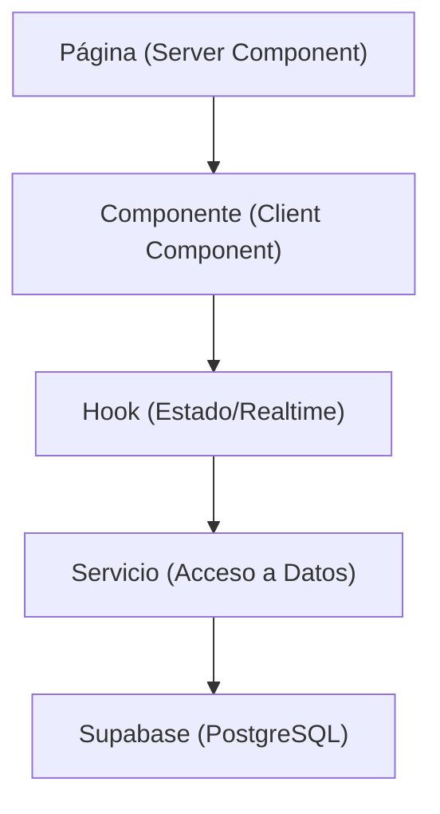

# 🎶 FestiApp — Plataforma de Experiencia en Festivales

FestiApp es un MVP (Producto Mínimo Viable) diseñado para mejorar la experiencia de los asistentes a festivales de música y optimizar la gestión de recursos por parte de la organización. Evita las largas colas en las barras, permite pagos sin efectivo (cashless) y proporciona datos en tiempo real al equipo administrativo.

---

## 🎯 Visión del Proyecto y Funcionalidades (MVP)

### Para el Asistente:
- **Mapa de Barras (Realtime)**: Visualización en tiempo real del estado de las colas de cada barra (Baja 🟢, Media 🟡, Alta 🔴).
- **Billetera Digital (Wallet)**: Consulta de saldo, historial de transacciones y recarga de saldo vinculada al código de pulsera (`token_pago`).
- **Notificaciones**: Avisos in-app (push-like) con sugerencias cuando las barras cambian a estado de cola "baja".
- **Identificación sin contraseña**: Acceso usando únicamente el código de la pulsera, sin sistema tradicional de login.

### Para la Organización (Staff / Admin):
- **Control de Barras**: Actualización manual del estado de afluencia de cada barra del recinto.
- **Dashboard y Métricas**: Visualización en tiempo real del volumen de ventas, saldo promedio y transacciones globales.
- **Gestión de Camareros**: Analíticas de rendimiento y horas trabajadas por el personal de barras.

---

## 🛠️ Stack Tecnológico

- **Framework**: Next.js 14+ (App Router, Server & Client Components)
- **UI & Estilos**: React 18, Tailwind CSS v4, shadcn/ui (Radix UI)
- **Backend & Base de Datos**: Supabase (PostgreSQL), Supabase Realtime
- **Despliegue**: Vercel
- **Herramientas de Calidad**: TypeScript estricto, ESLint

---

## 🏗️ Arquitectura y Patrones de Diseño

La arquitectura de la aplicación separa claramente la responsabilidad de la UI, el estado y el acceso a datos.



1. **Páginas (`app/`)**: Preferiblemente *Server Components* para realizar fetching inicial de datos de manera eficiente.
2. **Componentes (`components/`)**: *Client Components* (`'use client'`) solo cuando se necesita interactividad, manejo de estado o eventos del lado del cliente.
3. **Hooks (`hooks/`)**: Encapsulan lógica de estado, efectos y suscripciones en tiempo real a Supabase (ej. `useBarrasEnTiempoReal.ts`).
4. **Servicios (`servicios/`)**: Capa exclusiva para consultas a la base de datos (Supabase). **Los componentes NUNCA interactúan directamente con Supabase**.

---

## 📂 Estructura de Directorios

```text
src/
├── app/                  # Rutas principales (Next.js App Router)
│   ├── (auth)/           # Pantalla de login/acceso con código de pulsera
│   ├── (usuario)/        # Rutas públicas/asistente: mapa, billetera, notificaciones
│   └── (admin)/          # Rutas privadas/staff: control de barras, dashboard, camareros
├── components/           # Componentes agrupados lógicamente
│   ├── ui/               # Componentes base (shadcn/ui)
│   ├── mapa/             # Tarjetas, grid de barras
│   └── billetera/        # Tarjeta de saldo, formulario de recarga
├── hooks/                # Custom hooks (estado local y realtime con Supabase)
├── servicios/            # Peticiones y mutaciones hacia Supabase (.servicio.ts)
└── lib/                  # Configuración central
    ├── supabase/         # Clientes de supabase (navegador, servidor, middleware)
    ├── tipos.ts          # Interfaces globales en TypeScript
    └── utils.ts          # Utilidades (cn, formateo de fechas/monedas)
supabase/
└── migrations/           # Migraciones y esquema SQL de la base de datos
```

---

## 🗄️ Esquema de Base de Datos y Tipos

La persistencia de datos se gestiona en Supabase (PostgreSQL). Las tablas SQL (snake_case) se mapean consistentemente a interfaces TypeScript (camelCase) a nivel de *Servicios*.

* Tablas principales:
  * `usuario` (`id_usuario`, `token_pago`, `correo`, etc.)
  * `barras` (`id_barra`, `nombre_localizacion`, `estado_cola`)
  * `wallet` (`id_wallet`, `id_usuario`, `saldo`)
  * `transacciones` (`id_transaccion`, `id_wallet`, `id_barra`, `tipo_movimiento`, `monto`, `fecha`)
  * `camareros` y `asignaciones_camareros` (Gestión de personal)

**Convención estricta**: Los tipos base se definen centralizadamente en `src/lib/tipos.ts`. Evita duplicar declaraciones de interfaces a lo largo de los componentes.

---

## 🤖 Reglas y Convenciones para Agentes IA (Contexto Crítico)

Si eres un LLM o agente analizando este repositorio para continuar su desarrollo, **aplica siempre estas reglas**:

1. **Idioma**: Todo el código, comentarios, variables, interfaces y commits deben redactarse en **ESPAÑOL**. Las únicas excepciones son palabras reservadas del lenguaje o librerías externas.
2. **Reglas Estructurales**:
   * **JAMÁS** llames a Supabase desde un componente. Usa funciones ubicadas en la carpeta `servicios/`.
   * **JAMÁS** crees un componente en el directorio raíz de `components/`. Clasifícalo en una subcarpeta funcional (ej. `components/mapa/MiComponente.tsx`).
   * **SIEMPRE** usa el alias de ruta `@/` para importaciones dentro de `src/`. No recurrir a rutas relativas como `../../`.
3. **Estilos**:
   * Usa Tailwind CSS directamente en el código de JSX.
   * Utiliza la función envoltorio `cn()` de `lib/utils.ts` para mezclar o procesar clases dinámicas.
   * **NUNCA** utilices estilos *inline* (la prop `style={{}}`).
4. **Nomenclatura**:
   * Archivos de Componentes React: `PascalCase.tsx`
   * Componentes Funcionales: `PascalCase`
   * Funciones, Hooks y Variables: `camelCase`
   * Constantes: `SCREAMING_SNAKE_CASE` (ej. `ESTADOS_COLA`)
   * Servicios: `nombreEntidad.servicio.ts`
5. **Git Workflow**:
   * Usar Conventional Commits redactados en español: `feat(dashboard): añadir metricas`, `fix(billetera): reparar error de recarga`.
   * Ramas: Usar `feature/nombre-de-rama`, `fix/nombre-de-rama`, y apuntar siempre el Pull Request contra la rama `dev`.

---

## 🚀 Guía de Inicio Local

1. Copia el archivo de entorno y llénalo con las credenciales de Supabase del proyecto:
   ```bash
   cp .env.example .env.local
   ```
2. Instala las dependencias necesarias:
   ```bash
   npm install
   ```
3. Ejecuta el servidor local de desarrollo:
   ```bash
   npm run dev
   ```
   *Accede a la aplicación a través de: [http://localhost:3000](http://localhost:3000)*
